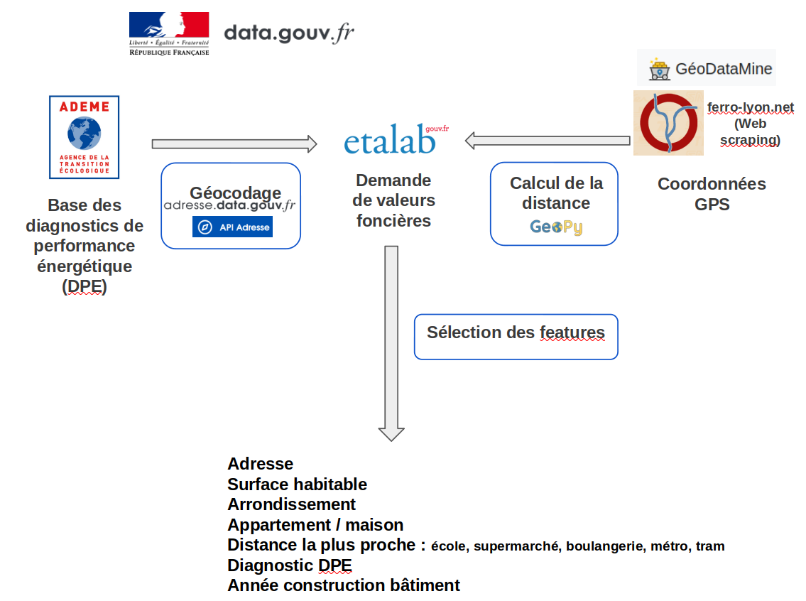

# Bloc_6
**Final project for certification**

Contact : Lise Gnos  
email : lise.gnos@gmail.com

> Video link : 👉  👈

The project aims at predicting real estate prices for flats and houses in the city of Lyon (France).

Team of the project :
- Arnaud Dalais : arnaud.dalais@free.fr
- Christophe Derache : christophe.derache@gmail.com
- Vincent Galli : galli.vincent.ts6@live.fr
- Lise Gnos : lise.gnos@gmail.com

The project contains 3 parts :
- Data collection
- Machine learning
- App : deployment of 2 apps

The following file contains the slides we prepared for our Demoday that took place in December 6th 2022 :
> Presentation pptx : Projet immobilier Lyon.pptx

Demoday replay on Youtube :
> https://www.youtube.com/watch?v=Hbn9JkuRaWk (read from 39 minutes)

# YOU CAN TEST THE APPLICATION ONLINE : 
> https://app-streamlit-immo.herokuapp.com/

# 1/ DATA COLLECTION

Our data come from several sources. Here is an illustration in order to understand the process :

## Source 1 : 'Demande de valeurs foncières'

Database from Etalab https://app.dvf.etalab.gouv.fr/  
Database from Insee https://www.insee.fr/fr/statistiques/6665809#tableau-ipla-g1-fr

EDA_and_cleaning:

> Notebook : ‘data_collection/EDA_and_cleaning/create_etalab_and_index.ipynb’

> Inputs of the notebook : ‘src/69_2017.csv.gz … src/69_2022.csv.gz’ and ‘index_prix.xlsx’

In this notebook we take the csv file from Etalab for the city of Lyon. The file gives all the realties sold since 2017 in Lyon city. Added columns from database of insee: 'index_prix'

> Output of the notebook : 'src/immo_lyon17_22_last.csv' ready for adding the web scraping step
> Output of the notebook : 'src/immo_lyon17_22Epuré.csv' ready for being used on the streamlit app

> Notebook : ‘data_collection/EDA_and_cleaning/etalab_EDA.ipynb’

In this notebook we do different visualizations.

## Source 2 : Web scraping

Sources of web-scraping: www.ferro-lyon.net / geodatamine.fr

> Python scripts: 'data_collection/scraping_metro_tram/…'

You will find into this folder each python scripts which scraps coordinates and names of metro / tram stations in Lyon

> Output of these scripts : 'save_output_scraping' folder

(these files have been moved into clean_and_concatenation folder)

## Data cleaning

> Folder : data_collection/clean_and_concatenation_metrotram_geodatamine/

You will find into this folder 4 jupyter notebooks and all data sources.
1. raw geodatamine data cleaning
2. raw scraped data cleaning
3. both previous cleaned data concatenation
4. final dataframe creation

## Calculation of distances

> Notebook : 'data_collection/distance_computing/add_distances.ipynb'

> Inputs of the notebook : 
> - 'final_interest_dataframe_filtered.csv'
> - 'src/immo_lyon17_22_last.csv'
			 
> Output of the notebook : 'save_output/20221129-114802-full.csv'

## Adding geokey

> Notebook : 'data_collection/code-etalab-geokey.ipynb'

> Input of the notebook : 'src/20221129-114802-full.csv'

For each row, we get a geokey (unique key for one address) by using the API : https://adresse.data.gouv.fr/api-doc/adresse

> Output of the notebook : 'src/df_etalab_geokey_221130.csv'

## Source 3 : 'Diagnostics DPE'

Databases from ADEME agency (3 csv files) :
- https://www.data.gouv.fr/fr/datasets/5ee2391763c79811ddfbc86a/
- https://www.data.gouv.fr/fr/datasets/dpe-logements-existants-depuis-juillet-2021/
- https://www.data.gouv.fr/fr/datasets/dpe-logements-neufs-depuis-juillet-2021/

> Inputs of the notebook :
> - 'src/dpe-69.csv'
> - 'src/dpe-lyon-ancien-21.csv'
> - 'src/dpe-lyon-neuf-21.csv'

> Notebook : 'data_collection/code-dpe-geokey.ipynb'

The files gives the result of all the energetical diagnostics for the city of Lyon since 2013.  
The methodology for the diagnostics have changed in july 2021.  
We concatenated the 3 files on similar columns.  
The dataset was also completed with the geokey.  

> Output of the notebook : 'src/df_dpe_geokey_221129.csv'

## Joining the sources

> Inputs of the notebook :
> - 'src/df_etalab_geokey_221130.csv'
> - 'src/df_dpe_geokey_221129'

> Notebook : 'data_collection/code-all.ipynb'  

In this notebook we join the 2 datasets thanks to the geokey, which is the only common column of the 2 datasets.  
We did a left join and also an inner join.

> Outputs of the notebook :
> - 'src/df_model_left_221201.csv'
> - 'src/df_model_inner_221201.csv'

# 2/ MACHINE LEARNING

## Test several models and choose the best

> Notebook : 'machine_learning/immoML_DBSCAN_XGBoost.ipynb'

> Input of the notebook : 'nouveaux_datasets/df_model_inner_221201.csv'

> Outputs of the notebook : 'machine_learning/dataframes of scores for each loop on several models'

## Train the best model on all datas and export the model + preprocessor

> Notebook : 'machine_learning/train_and_save_best_ML_model.ipynb'

> Input of the notebook : 'nouveaux_datasets/df_model_inner_221201.csv'

> Output of the notebook : 'machine_learning/model_recorded/xgbregressor.joblib'

# 3/ APP

## Streamlit app

> Script : 'immo-lyon-app.py'

The app is user friendly. The user fill out the questionnaire about the property she or he wants to sell.  
After pushing the submit button, the map shows 10 properties sold close to the location with their surface and price.  
The app also shows the estimation of the price of the user's property.  
To do that, the app sends a POST request to the FastAPI app in order to have a prediction from the machine learning model.

> The folder comes with the following files :  
> - Dockerfile
> - run.sh : not used but can be used if the container is run locally
> - immo_lyon17_22Epuré.csv : the dataset with all the real estates sold in Lyon, in order to show several properties on the map
> - config.toml in the folder .streamlit : configuration of the streamlit app

The app was packaged in a docker container and pushed to Heroku.  
URL of the API :
https://app-streamlit-immo.herokuapp.com/

## FastAPI app

> Script : 'app.py'

The API can receive POST requests in order to run the machine learning model and send back the prediction. The input comes from the questionnaire in the streamlit app.

> The folder comes with the following files :  
> - Dockerfile
> - requirements.txt
> - run.sh : not used but can be used if the container is run locally
> - xgbregressor.joblib : the machine learning model
> - final_interest_dataframe_filtered.csv : the list of the useful places in Lyon in order to calculate minimum distances

The app was packaged in a docker container and pushed to Heroku.  
URL of the API :  
https://app-immo-lyon.herokuapp.com/
